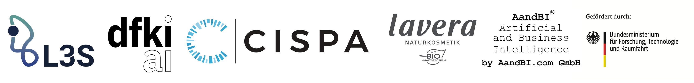

# Sichere Sprachmodelle für das Wissensmanagement (SisWiss)

Welcome to the official GitHub Organization of the BMFTR-funded research project **SisWiss** (a German abbreviation for *Secure Language Models for Knowledge Management*).

## Further Information

* **Preliminary Project Page:** https://www.l3s.de/research-at-l3s/all-projects/siswiss/
* **Project Duration:** 3 Years (01.06.2025 - 31.05.2028)

## Project Members and Funding Organization

| Organization  | Type | Lead |
| :---: | :---: | :---: |
| [Leibniz University of Hannover / L3S Research Center (**L3S**)](https://www.l3s.de/) | University | Dr. Daniel Kudenko |
| [German Research Center for Artifical Intelligence (**DFKI**)](https://www.dfki.de/en/web) | Research Institute| Dr. Stefan Schaffer |
| [CISPA Helmholtz Center for Information Security (**CISPA**)](https://cispa.de/en) | Research Institute | Dr. Lea Schönherr |
| [Laverana GmbH & Co. KG (**Laverana**)](https://www.laverana.com/) | Large Enterprise | Thorben Warnebold |
| [AandBI.com GmbH (**AandBI**)](https://www.aandbi.com/indexMain.php) | Small and Medium-sized Enterprise| Markus Grete |

### Current Members
| Name | Position(s) | Organization |
| :---: | :---: | :---: |
| Dr. Daniel Kudenko | Lead & Project Coordinator | L3S |
| Markus Grete | Lead | AandBI |
| Dr. Stefan Schaffer | Lead | DFKI |
| Dr. Lea Schönherr | Lead | CISPA |
| Thorben Warnebold | Lead | Laverana |
| Aaron Ruß | Research Associate | DFKI |
| Dren Fazlija | Research Associate (PhD Student) | L3S |
| Devansh Srivastav | Research Associate (PhD Student) | CISPA |
| Yuan Xue | Research Associate (PhD Student) | L3S |
| Monty-Maximilian Zühlke | Research Associate (PhD Student) | L3S |

> [!NOTE]
> Funded by the [German Federal Ministry of Research, Technology and Space (**BMFTR**)](https://www.bmftr.bund.de/EN/Home/home_node.html) under grant number 16KIS2328K.

## Related Work
| Title  | Authors | Venue |
| :---: | :---: | :---: |
| [Out-of-context and out-of-scope: Manipulating large language models through minimal instruction set modifications](https://journals.plos.org/plosone/article?id=10.1371/journal.pone.0341558) | **Monty-Maximilian Zühlke**, **Daniel Kudenko**, Wolfgang Nejdl | [PLOS One](https://journals.plos.org/plosone/) |
| [Towards Sensitivity-Aware Language Models](https://drenfazlija.github.io/towards-sa-llms/) | **Dren Fazlija**, Iyiola E. Olatunji, **Daniel Kudenko**, Sandipan Sikdar | [AISTATS 2026](https://virtual.aistats.org/Conferences/2026) |
| [ConVerse: Benchmarking Contextual Safety in Agent-to-Agent Conversations](https://arxiv.org/abs/2511.05359) | **Amr Gomaa**, Ahmed Salem, Sahar Abdelnabi | [EACL 2026](https://2026.eacl.org/) |
| [ACCESS DENIED INC: The First Benchmark Environment for Sensitivity Awareness](https://aclanthology.org/2025.findings-acl.684/) | **Dren Fazlija**, Arkadij Orlov, Sandipan Sikdar | [ACL 2025](https://2025.aclweb.org/) |
| [Firewalls to Secure Dynamic LLM Agentic Networks](https://arxiv.org/abs/2502.01822) | Sahar Abdelnabi, **Amr Gomaa**, Eugene Bagdasarian, Per Ola Kristensson, Reza Shokri | arXiv |
